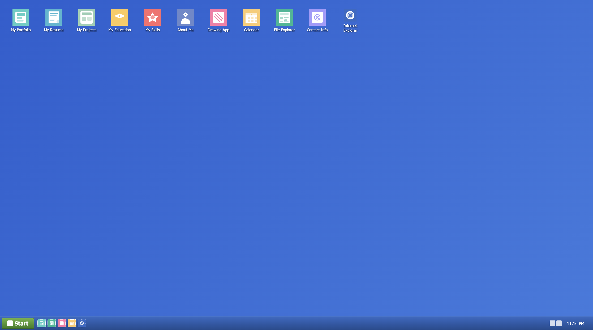

# Windows XP Portfolio Web OS

A fully functional, browser-based clone of Windows XP built with pure HTML, CSS, and JavaScript. This interactive portfolio showcases my skills and projects through an authentic Windows XP desktop experience.


## 🌟 Live Demo

[🔗 Try it here!](https://wazehfarhan.github.io/Winxp-OS-portfolio/)

## 📸 Preview

<div align="center">
  
| Login Screen | Desktop Environment | Applications |
|:------------:|:-------------------:|:------------:|
|  |  |  |

</div>

## 🚀 Features

### 🖥️ Core System
- **Authentic Windows XP UI** - Complete with gradients, shadows, and animations
- **Functional Desktop** - Icons, context menus, and wallpaper
- **Taskbar** - Start menu, quick launch, system tray with real-time clock
- **Window Management** - Drag, resize, minimize, maximize, and close windows
- **Login System** - Password-protected entry (password: `1234`)

### 📱 Applications
- **My Portfolio** - Personal introduction and skills overview
- **My Resume** - Education, experience, and technical competencies
- **My Projects** - Showcase of completed projects with descriptions
- **My Education** - Academic background and coursework
- **My Skills** - Technical skills with visual progress indicators
- **About Me** - Personal story and interests
- **Contact Info** - Professional contact information
- **Drawing App** - Canvas-based drawing with brush controls
- **Calendar** - Functional calendar with month navigation
- **File Explorer** - Simulated file system with folders and files
- **Internet Explorer** - Web browser for portfolio navigation
- **Notepad** - Basic text editor

## 🛠️ Technology Stack

- **Frontend**: Pure HTML5, CSS3, Vanilla JavaScript (ES6+)
- **Architecture**: Modular component-based design
- **Styling**: Custom CSS with XP-themed gradients and animations
- **Icons**: Custom SVG illustrations
- **No Dependencies**: Built without any external frameworks or libraries

## 📁 Project Structure

    windows-xp-portfolio-os/
    │
    ├── index.html              # Main application entry point
    ├── style.css               # Main stylesheet
    ├── script.js               # Application bootstrap
    │
    ├── css/
    │   └── xp.css              # Windows XP specific styles
    │
    ├── system/                 # Core OS components
    │   ├── windowManager.js    # Window management system
    │   ├── taskbar.js          # Taskbar functionality
    │   └── startMenu.js        # Start menu operations
    │
    ├── apps/                   # Application modules
    │   ├── portfolio.js        # Portfolio application
    │   ├── resume.js           # Resume viewer
    │   ├── projects.js         # Projects showcase
    │   ├── education.js        # Education information
    │   ├── skills.js           # Skills visualization
    │   ├── about.js            # About me section
    │   ├── contact.js          # Contact information
    │   ├── drawing.js          # Drawing application
    │   ├── calendar.js         # Calendar application
    │   ├── explorer.js         # File explorer
    │   ├── notepad.js          # Text editor
    │   └── internet-explorer.js # Web browser
    │
    └── assets/
        ├── icons/              # Application icons (SVG)
        └── wallpapers/         # Desktop backgrounds


## 🎯 Quick Start

### Prerequisites
- A modern web browser (Chrome, Firefox, Safari, Edge)
- No server requirements - runs entirely client-side

### Installation

1. **Clone the repository**
   ```bash
   git clone https://github.com/wazehfarhan/Winxp-OS-portfolio.git
   cd Winxp-OS-portfolio
   

2. **Run Locally**
    Open index.html in your web browser, or
    Use a local server:
    ```bash
    # Using Python
    python -m http.server 8000

    # Using Node.js
    npx http-server

    # Using PHP
    php -S localhost:8000
3. **Login**

    - **Username: Guest (or any name)
    - **Password: 1234
### 🎮 How to Use
    Basic Navigation
    Double-click desktop icons to open applications

    Click and drag window title bars to move windows    

    Use the resize handle (bottom-right) to resize windows

    Right-click on desktop for context menu

    Click Start button for application menu

### Application Features
    Drawing App: Use brush size slider and color picker to draw

    Calendar: Navigate months with arrow buttons, click dates

    Internet Explorer: Browse portfolio sections via the website list

    File Explorer: Click folders and files to view information


